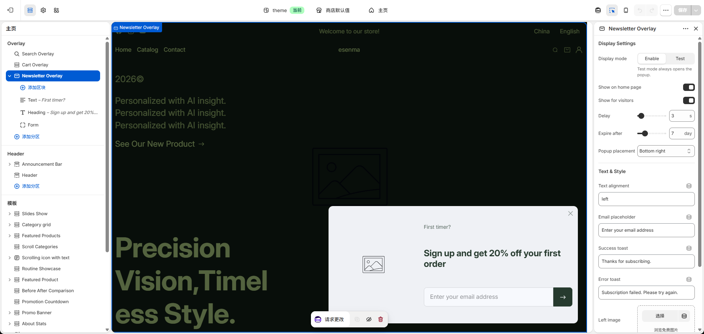

# Theme Editor Basics

The theme uses Shopify Online Store 2.0 architecture.

In the Theme Editor, you can:

- Switch between templates.
- Add, remove, hide, and reorder sections.
- Manage blocks inside sections.
- Preview desktop and mobile layouts.
- Save changes without publishing the theme.

