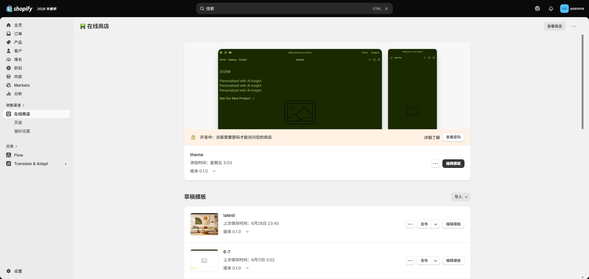

# 安装主题

1. 登录 Shopify 后台。
2. 进入 **在线商店 → 主题**。
3. 点击 **添加主题 → 上传 ZIP 文件**。
4. 上传原始主题 ZIP 安装包。
5. 等待 Shopify 完成处理。
6. 点击 **自定义**，先编辑未发布主题。
7. 完成测试后再点击 **发布**。

## 注意

非必要不要解压后重新压缩主题。错误的 ZIP 目录层级可能导致 Shopify 提示主题文件缺失。
